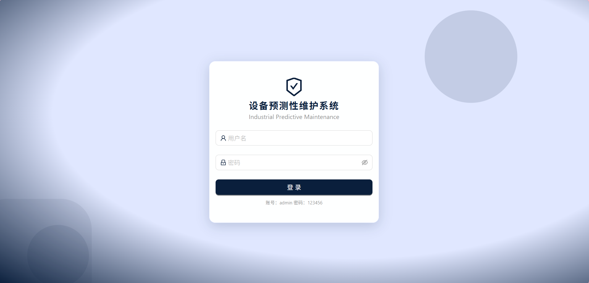
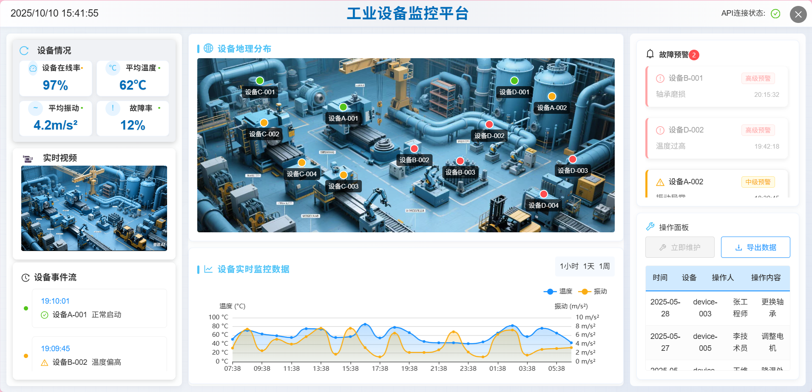
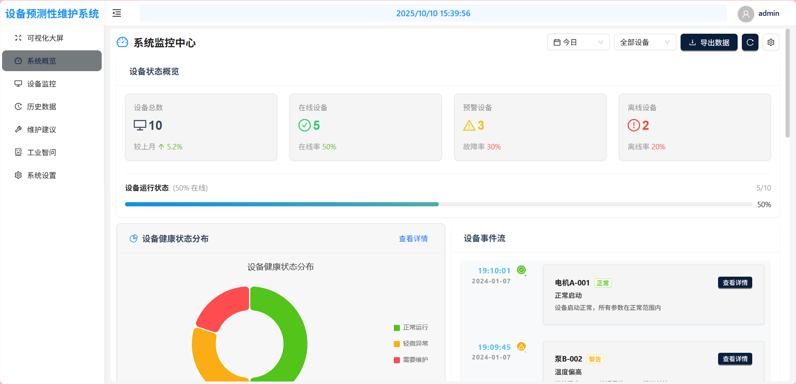
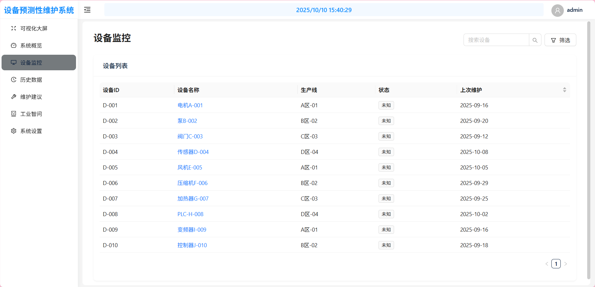
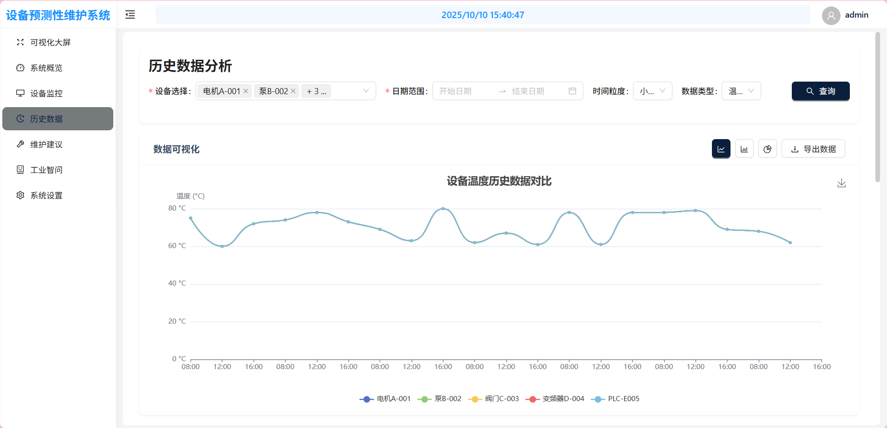
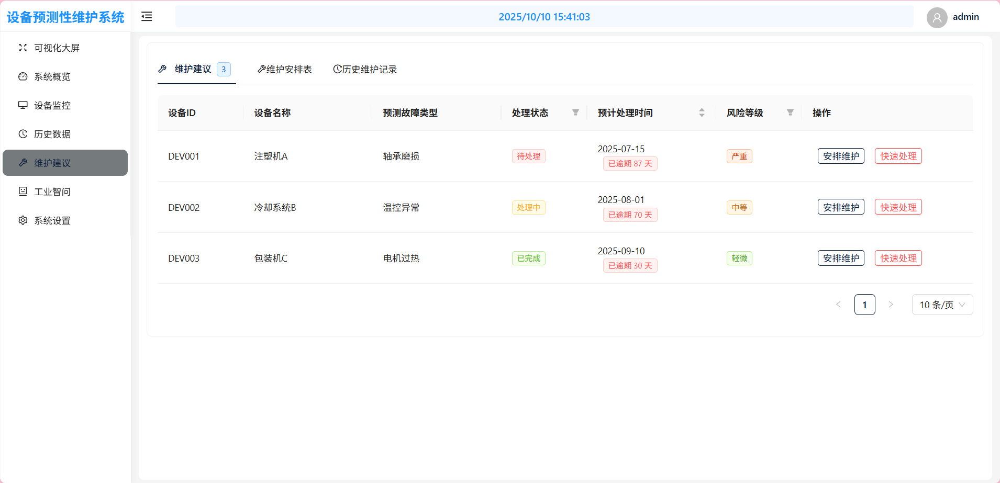
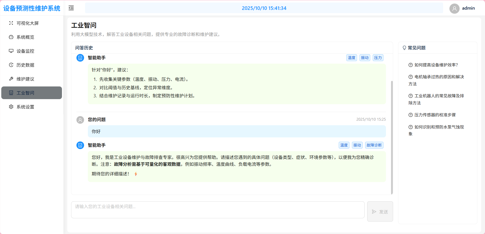
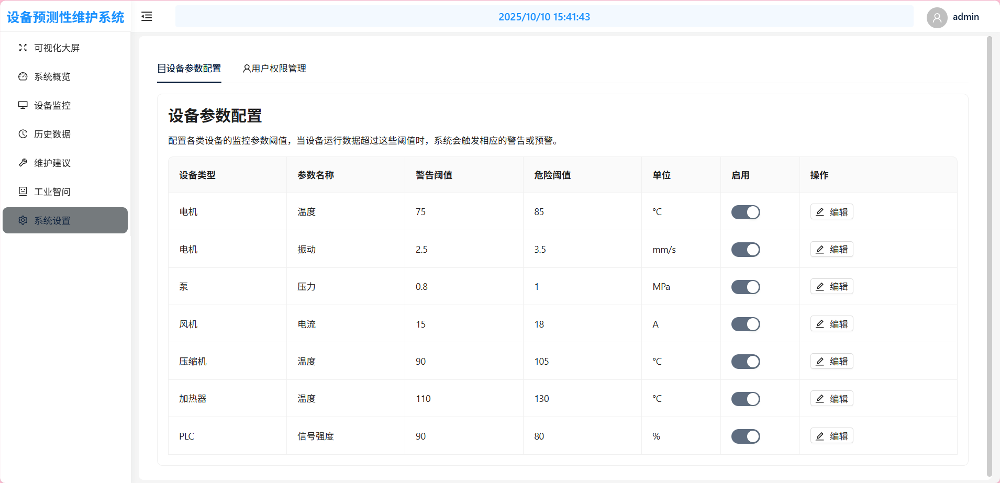

# 工业设备预测性维护前端项目（纯前端 Mock 版）

本项目基于 Vite + React + Ant Design 搭建，已按需移除所有后端依赖，使用本地 Mock 数据进行页面展示与交互。支持本地登录、路由保护、设备看板、大屏展示、工业问答等功能。

## 1. 技术栈
- React 18
- Vite 6
- React Router 6
- Ant Design 5
- ECharts 5
- XLSX（前端导出 Excel）

## 2. 启动与构建
在 `front/` 目录下运行：

```bash
# 安装依赖
pnpm i  # 或 npm i / yarn

# 启动开发
pnpm dev  # 默认 http://localhost:5173

# 构建
pnpm build

# 本地预览构建产物
pnpm preview
```

## 3. 目录结构（简化）
- `front/src/pages/`
  - `Login/` 登录页（纯前端校验账号/密码，保存本地 token）
  - `Dashboard/` 仪表盘
  - `DeviceMonitoring/` 设备监控
  - `BigScreen/` 大屏展示
  - `IndustrialQA/` 工业问答（本地模拟回答）
- `front/src/components/`
  - `auth/ProtectedRoute.jsx` 受保护路由（每次渲染校验 token）
  - `layout/MainLayout.jsx` 布局
- `front/src/api/` 本地 API Mock（已去除真实网络请求）
  - `devic.js` 模拟设备列表与详情
  - `alarm.js` 模拟告警列表与详情
- `front/src/services/`
  - `aiService.js` 本地模拟 AI 回答与标签提取
- `front/src/utils/`
  - `auth.js` 登录信息与 token 本地存储、校验工具

## 4. 鉴权与路由说明（纯前端）
- 登录账号/密码：`admin` / `123456`
- 登录成功：
  - `auth.js` 的 `saveAuth()` 会在 `localStorage` 中保存：
    - `user`：用户名与密码（仅演示用途）
    - `token`：包含 `username`、`issuedAt`、`expiresAt`、`sign` 的简单对象（默认 24 小时有效）
  - 页面跳转至 `/`
- 路由保护：
  - `components/auth/ProtectedRoute.jsx` 在每次路由渲染时执行：
    - 通过 `getToken()` 读取本地 token
    - 通过 `isTokenValid()` 校验是否过期/合法
    - 失败则 `clearAuth()` 并跳转 `/login`，保留来源地址 `state.from`

## 5. Mock 数据策略
- 设备列表/详情：`src/api/devic.js` 返回 `{ code: 200, rows/data }`，字段与页面消费一致
- 告警列表/详情：`src/api/alarm.js` 返回 `{ code: 200, rows/data }`
- 工业问答：`src/services/aiService.js` 使用本地模板延迟 600ms 返回回答，`extractTags()` 做简单标签提取
- 大屏关键指标：`pages/BigScreen/data.js` 中的静态数据直接使用

## 6. 重要变更（相对传统后端版）
- 已移除/不再使用的内容：
  - 真实后端登录、验证码
  - 网络请求封装 `utils/request.js` 与 axios 依赖（可按需移除）
  - `src/api/login.js`（可删除或保留作后续接入占位）
- 登录逻辑迁移为前端校验，默认账号 `admin/123456`

## 7. 常见操作
- 修改默认登录账号密码：
  - 在 `pages/Login/index.jsx` 的 `onFinish()` 中调整校验逻辑
- 调整 token 有效期：
  - 在 `utils/auth.js` 的 `generateMockToken(username, ttlMs)` 中传入自定义 `ttlMs`
- 清除登录状态：
  - 调用 `utils/auth.js` 的 `clearAuth()`，或手动清空 `localStorage` 中的 `user` 与 `token`

## 8. 注意事项（演示模式）
- 为了演示方便，`user` 与 `token` 均存储在 `localStorage`，不具备任何安全性，仅供示范
- 所有数据来源为前端 Mock，不代表真实接口约定
- 如需接入后端，请：
  1. 恢复/实现 `utils/request.js` 与真实 API
  2. 在 `src/api/*` 中改为真实网络请求
  3. 更新 `ProtectedRoute` 的校验逻辑以匹配后端签发的 token

## 9. 许可证
本项目仅用于学习与演示，按需自取、自由修改。


## 10.页面展示















